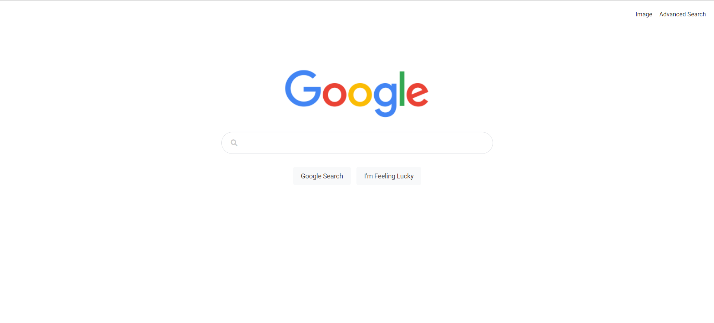
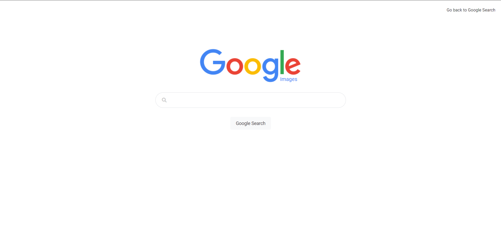
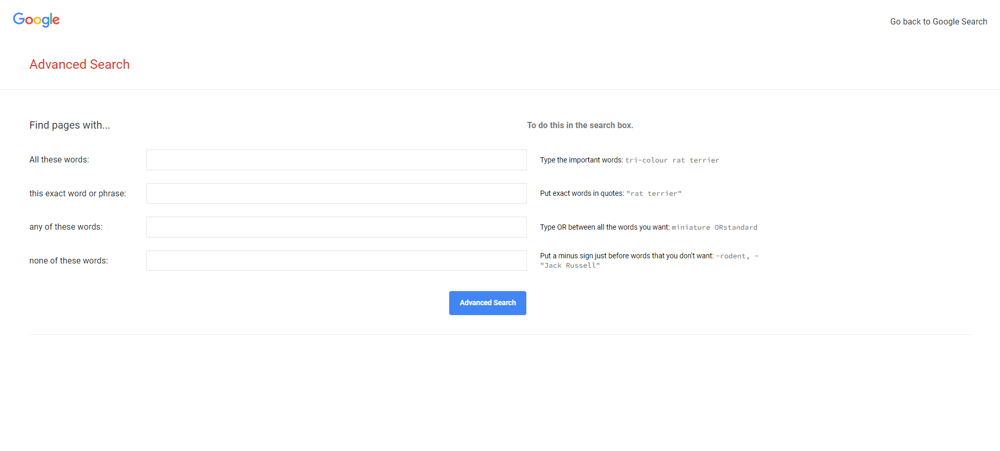

# CS50's Web Project 0 - **Search**

- [CS50's Web Project 0 - **Search**](#cs50s-web-project-0---search)
  - [Overview](#overview)
  - [Features](#features)
  - [Technologies](#technologies)
  - [Requirements](#requirements)
  - [Installation](#installation)
  - [Project Structure](#project-structure)

## Overview
This is the **"Search"** project, developed as part of the CS50's Web Programming with Python and JavaScript course. This project involves designing a front-end interface for Google Search, Google Image Search, and Google Advanced Search. The application sends data to Google's servers using GET parameters and replicates Google's search functionality. <a href="https://cs50w-search.vercel.app/" target="_blank">Click here to run project</a>

## Features
- **Google Search Page:** 
  - Allows users to perform Google searches.
  - Features a centered search bar with rounded corners and a "Google Search" button below it.
  - Includes an "I’m Feeling Lucky" button that takes users directly to the first search result.
  

- **Google Image Search Page:** 
  - Enables users to perform image searches on Google.
  - Includes a link to return to the Google Search page.
  

- **Google Advanced Search Page:**
  - Provides input fields for:
    - “All these words:”
    - “This exact word or phrase:”
    - “Any of these words:”
    - “None of these words:”
  - Each field is vertically stacked and left-aligned.
  - Features a blue "Advanced Search" button with white text.
  

## Technologies
- **Front-end:**
  - HTML
  - CSS

<div style="display:flex; align-item:center; gap:12px;">
    
    
</div>

## Requirements
- Web Browser

## Installation
1. Download the distribution code from [here](https://cdn.cs50.net/web/2020/spring/projects/0/search.zip) and unzip it. Alternatively, manually create the HTML files following the specifications.

2. Open the `index.html` file in a web browser:
   ```bash
   open index.html  # For Unix or MacOS systems
   start index.html  # For Windows systems

## Project Structure

- `index.html` - Page for Google Search.
- `image.html` - Page for Google Image Search.
- `advanced.html` - Page for Google Advanced Search.
- `static/` - Directory for static files such as images and CSS.
- `css/` - Directory for CSS files.
- `img` - Directory for images.
